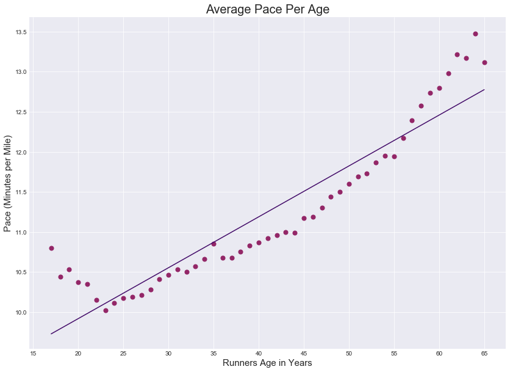
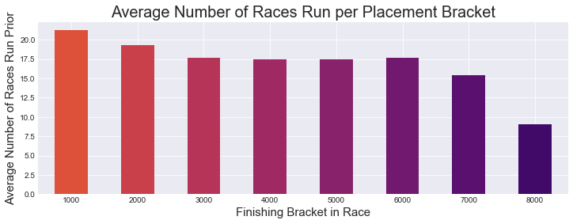
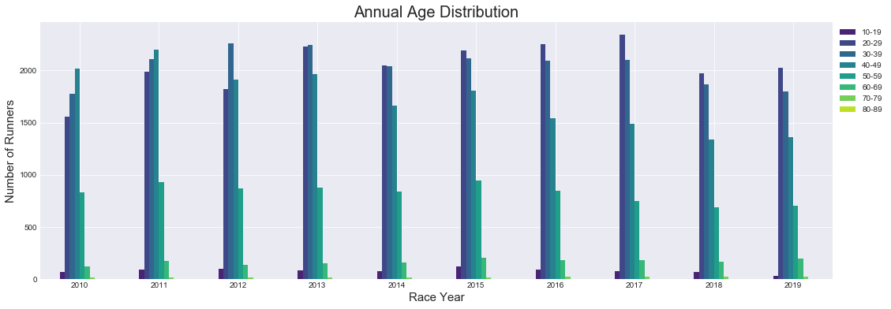
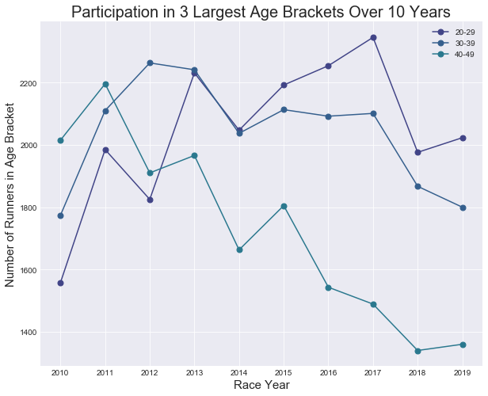
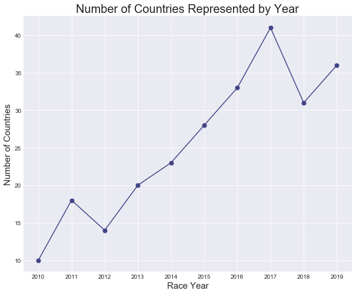

# 🗽 NYRR Women's Half-Marathon 🏃‍♀️
## Objective 🎯:
The goal of this project is to analyze data from the **New York Road Runner's Women's Half-Marathon** from 2010 to 2019 to identify trends in and gather insight regarding the runners and race results. 

## Data Source 🗄:
I couldn't find the desired data in a structed, easy to use format, so I mined the data from 
[NYRR Half Marathon](https://results.nyrr.org/event/b00425/finishers) using a cURL command to the NYRR API endporint (https://results.nyrr.org/api/runners/finishers-filter).

All raw data (JSON files) is provided in the Data folder.

## Graphs & Insights 📊:

### Average Pace Per Age   

- **Fastest age is 23** with an average pace of 10.02 minutes per mile.

### Average Number of Races Run per Placement Bracket

- There is a positive correlation between the number of races ran prior to the half marathon and a low (better) finishing place.
- Runners who finished in the top 1000 ran on average 21 races prior. 
- Runners who finished in the bottom 1000 ran on average 9 races prior.

### Annual Age Distribution

- Year-to-year the most populous age brackets are 20-29, 30-39, and 40-49.

### Annual Participation in the 3 Most Populous Age Brackets 

 - In 2010 and 2011 the most populous age bracket was 40-49. Between 2010 and 2019 the number of runners in this age bracket dropped by 32.5%, surpased in number by the other two most populous age brackets (20-29 and 30-39). 
- The number of runners aged 20-29 increased by 23% between 2010 and 2019.
- The number of runners ages 30-39 increased by nearly 28% between 2010 and 2012 when representation in this age bracket peaked; however, by the end of the decade there was only a 1.5% increase in the number of runners ages 30-39 from the start of the decade.

### The 50 Most Common First Names of Top 500 Finishers 

- The following names are six of the 50 most common first names amongst runners who placed in the top 500, but are not amongst the 50 most common names of runners overall (uncommon top finisher names): Molly, Julia, Meghan, Victoria, Natalie, Erica.

### The 50 Most Common First Names of Runners 

- The following six names are amongst the 50 most commmon first names of runners across all years, but are not amonst the 50 most common names of top 500 finishers (common names that aren't top finishers): Barbara, Nancy, Kathleen, Kristen, Patricia, Linda.

### Number of Countries Represented by Year

- Runners from **10 (the fewest)** different countries participated in the 2010 race.
- Runners from **41 (the most)** different countries participated in the 2018 race.
- The mean number of countries represented is 24.4.

## Notes 📝:
- Each file is stand alone, feel free to fork the project and create your own insights about the Women's NYRR Half-Marathon.
- The race didn't take place in 2020 due to COVID-19.

